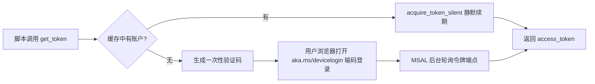

# Email Agent

接入 Outlook 个人邮箱的智能邮件助手。项目用 Microsoft Graph API 读取邮件，用 LangChain / LangGraph 构建分类与回复的 agent：新邮件到达后先被路由为 `ignore / notify / respond` 三类，需要回复的邮件由 agent 生成草稿，经人工确认后再发送，最终目标是配合 LangGraph store 实现按联系人的长期记忆。

```
email_agent/
├── main.py        # 总入口（待实现）
├── client/        # Outlook 接入层：认证 + Graph API 调用
│   ├── auth.py        # device code flow 认证与 token 缓存
│   └── connect.py     # Graph 接口连通性测试脚本
├── agent/         # 智能层：模型、路由、工具、prompt
│   ├── config.py      # 环境配置（待实现，计划用 pydantic-settings）
│   ├── model.py       # LLM 实例工厂
│   ├── prompts.py     # 提示词模板与分类规则
│   ├── route.py       # 邮件分类的 Route schema
│   ├── tools.py       # @tool 工具集
│   └── email_agent_with_outlook.py   # agent 组装（骨架）
└── test/          # 实验笔记本
```

运行方式：在仓库根目录执行 `python -m email_agent.main`，测试单个模块同理（如 `python -m email_agent.client.auth`），不要直接右键运行包内文件。

## Step 1 : 用户认证

### 这一步解决什么问题

agent 要代替用户操作邮箱，而 Graph API 的每一个请求都必须携带 access token。token 不是账号密码，它的本质是"用户授权这个应用代表自己"的凭据，有效期约 1 小时，过期后需要凭 refresh token 续期。所以认证模块的全部任务可以概括为一句话：**对外永远只暴露一个 `get_token()` 函数，任何时候调用它都返回一个有效的 token**，过期、刷新、缓存的细节全部对调用方透明。

### Azure 侧的准备工作

认证的前置条件是在 Microsoft Entra ID 里注册一个应用程序。注册完成后需要记下两个 ID：应用程序(客户端) ID 和目录(租户) ID，它们已经写入了系统环境变量。权限方面申请的是四个**委托权限**（delegated）：`User.Read`、`Mail.Read`、`Mail.ReadWrite`、`Mail.Send`——委托权限代表"以用户本人的身份行事"，个人 Outlook 账户自己同意即可，不需要管理员审批。另外有一个容易漏掉的开关：应用注册的"身份验证"页面里必须把**"允许公共客户端流"设为"是"**，它声明这个应用不使用客户端密钥、可以走公开客户端流程，不打开它，设备码流程会直接报 AADSTS7000218 错误。

### 设备码流程如何工作

个人 Outlook 账户配合桌面脚本场景，选 device code flow 最合适：它不需要在本地起回调服务器接收授权码，只需要用户在浏览器里完成一次配对。



脚本侧的逻辑顺序是：先 `get_accounts()` 查本地缓存里有没有账户，有就优先走 `acquire_token_silent()` 静默取 token（过期时 MSAL 自动用 refresh token 续，调用方无感）；缓存里没有才走设备码流程——`initiate_device_flow()` 生成一个 15 分钟有效的一次性验证码并打印出来，用户在浏览器输码登录授权后，`acquire_token_by_device_flow()` 轮询令牌端点拿到 token。

### Token 缓存设计

token 缓存用 MSAL 的 `SerializableTokenCache`，序列化后落盘到 `token_cache.bin`。两个设计要点：一是**只在 `cache.has_state_changed` 为真时写盘**，避免每次运行都产生无意义的文件写入；二是缓存路径目前是相对路径（`../token_cache.bin`），已知隐患是换目录运行会导致缓存"找不到"而重复扫码，待改进为用 `__file__` 锚定到 auth.py 所在目录。

> [!WARNING]
> `token_cache.bin` 等同于账号密码，任何拿到它的人都能以你的身份调 Graph API。该文件已在 .gitignore 中排除，严禁提交到 git。

### 调用方约定

上层模块（connect.py、将来的 tools）使用 token 的唯一正确姿势是**每次请求前现取**：`headers = {"Authorization": f"Bearer {get_token()}"}`。不要把 token 存进变量复用——变量里的 token 一小时后必然过期，而 `get_token()` 每次调用都会走静默续期路径，永远新鲜。

### 验证方式

运行本模块：第一次执行会打印验证码提示，浏览器完成登录授权后终端打印 token 前 20 位；**紧接着再跑一次，如果不要求输码、直接打印，说明缓存生效，认证层完成**。然后用该 token 调 `GET https://graph.microsoft.com/v1.0/me`，返回 200 和本人邮箱地址，即验收通过。

<details>
<summary>踩坑记录（点击展开）</summary>

**AADSTS50059（No tenant-identifying information）**：踩过两次。第一次是把租户 ID 填进了客户端 ID 的环境变量——服务器拿这个 GUID 找不到任何应用；第二次是 authority 写成了不带 `/common` 的裸域名。两者的共同点都是请求里定位不到应用，看到这个错误码优先检查这两个值。

**NameError: name 'requests' is not defined**：把 Graph 调用从笔记本搬到独立 py 文件后忘了 `import requests`。它发生在设备码授权成功**之后**，和认证无关，别被"授权都成功了怎么还报错"迷惑。

**重复要求扫码**：缓存文件用的是相对路径，笔记本和脚本的工作目录不同导致各自找各的缓存。临时的缓解办法是固定从同一目录运行，根治办法是改成基于 `__file__` 的绝对路径。

</details>

当前进度：认证模块已完成并通过全部验收（两次运行验证、/me 返回 200）。下一步是 Graph 收件箱接口的裸调验证（列出未读、createReply 建草稿），通过后进入 `agent/` 层的工具封装。
